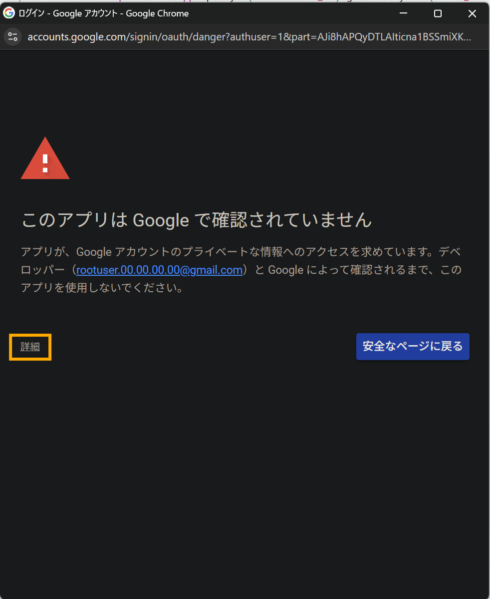
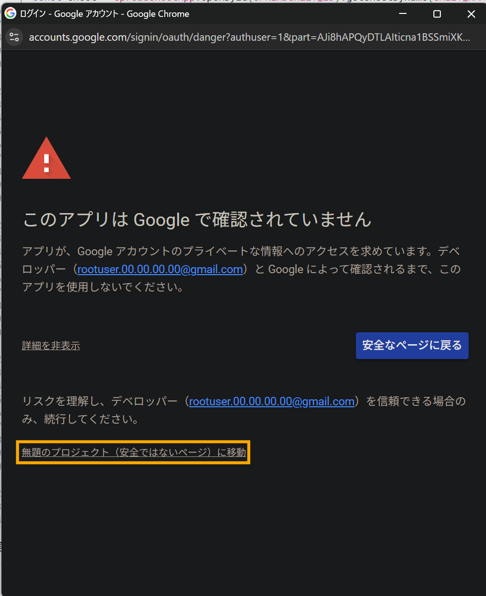
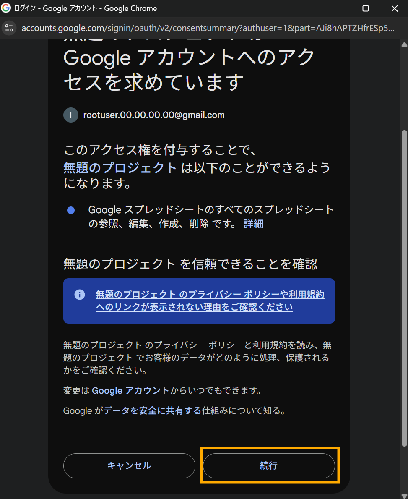

# 第1回：Googleスプレッドシートの成型と編集

## 概要
この課題では、GASを用いてGoogleスプレッドシートのデータを加工・成型し、整った形式での出力を実現します。フィルタ・並び替え・書式設定などを通じて、業務データの前処理自動化を学びます。

## 学習目標
- スプレッドシートのデータ読み取り・更新
- 条件に基づくデータ削除
- 並び替え処理
- 条件付き書式の適用

## 使用メソッド例
- `SpreadsheetApp.openById()`
- `SpreadsheetApp.getActiveSpreadsheet()`
- `getSheetByName()`
- `getDataRange().getValues()`
- `sort()`
- `deleteRow()`
- `setNumberFormat()`
- `setConditionalFormatRules()`

## 使用スプレッドシート
以下のテンプレートをコピーし、自分のGoogleアカウント上に保存してから使用してください。

📎 [課題用スプレッドシート（ワンピース版）](https://docs.google.com/spreadsheets/d/17c8XHpqRdroOp8WZ2xT1aople-zxKPcOcQo9PGFJ4UU/edit?usp=sharing)

## 実装内容
1. GASプロジェクトを作成
    1. [Google Apps Script](https://script.google.com/) を開く
    1. 新しいプロジェクトを作成
    3. `main.gs` にスクリプトを記述
    4. メニューから「サービス」→「スプレッドシートAPI」などを必要に応じて有効化
    5. `ファイル` → `プロジェクトのプロパティ` でスプレッドシートIDなどの変数を管理
    6. `実行` ボタンでスクリプトを実行し、権限を承認
2. **空欄行の削除**  
　B列（氏名）が空白の行をすべて削除してください。

2. **並び替え**  
　C列（誕生日）を昇順に並び替えてください（ヘッダー除く）。

3. **条件付き書式**  
　D列（好感度スコア）に対し、80以上は緑色、50未満は赤色で背景色を設定してください。

4. ### [アウトプットイメージ](https://docs.google.com/spreadsheets/d/1BdIJqchof24RIREjekTEbIVhMLpnIkn1d64JnA45b_I/edit?usp=sharing)

## チェックリスト
- [ ] スプレッドシートIDをハードコードせず、変数で管理しているか
- [ ] 空行の削除がB列を正しく判定基準としているか
- [ ] 並び替えが日付列に対して正しく行われているか
- [ ] 条件付き書式がスコア値に対して正しく適用されているか
- [ ] エラーハンドリング（例：データ

## 回答例
回答例はsample_answer.gsを参照ください。

## 参考：GAS実行時に表示される権限承認の対応方法
<table style="border-collapse: collapse;
              margin: 0;
              padding: 0;">
  <tr>
    <!-- 左セル：テキスト。valign="top" で必ず上詰め -->
    <td valign="top" style="padding: 0 16px 0 0; line-height: 1.5;">
      1. スクリプトを実行すると、権限承認のダイアログが表示されるため、「詳細」をクリック 
      2. 「安全ではないページに移動」をクリック 
      3. 「続行」をクリックして権限を承認
    </td>
    <!-- 右セル：縦に並べた3枚の画像。valign="top" で上詰め -->
    <td valign="top" style="padding: 0;">
      
      
      
    </td>
  </tr>
</table>

